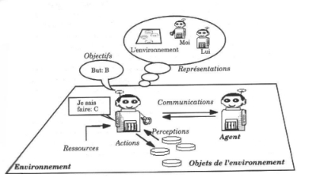

Simulation de la propagation d’un virus `a l’aide de

syst`emes multi-agents

Mathurin de Cr´ecy 8 juin 2022

Sommaire![ref1]

1  [Les mod`eles `a ´equations diff´erentielles ordinaires (EDO) le mod`ele SIR](#_page1_x9.91_y-1.00)

[la variante SEIR](#_page1_x9.91_y-1.00)

2  [Les Syst`emes Multi-Agents (SMA) introduction aux SMA](#_page1_x9.91_y-1.00)

[mes mod`eles](#_page1_x9.91_y-1.00)

3  [Bilan](#_page1_x9.91_y-1.00)

Le mod`ele SIR![ref1]

 Le mod`ele SIR est le plus c´el`ebre mod`ele ´epidemiologique pouvant pr´edire la propagation d’un virus. Il s’agit d’un mod`ele `a ´equations diff´erentielles dans lequel la population est divis´ee en cat´egories Sains, Inf´ect´es et R´emis. Les ´echanges entre ces cat´egories

sont dSdtdtdI r==´egis−SNβSpaNβrIles ´equations suivantes:

I − γI

dRdt = γI

D´efinitions

γ = 1/Tr β = KP R0 = β/γ

Les param`etres γ et β d´esignent respectivements le taux de gu´erison o`u Tr est le temps de gu´erison et le taux de contagion o`u P est la probabilit´e de transmission lors d’un contact et K est le nombre de contact d’une personne lors d’une journ´ee. Enfin, R0 est ce que l’on appel le taux de reproduction de la maladie, il repr´esente le nombre de personnes saines qu’un infect´e vas contaminer en une journ´ee.

Etude d’une population de 1200 habitants avec un patient initial sur 200 jours. R0=3 (covid-19 pr´e-confinement), temps de r´emission de 8 jours. Sauf pr´ecision on reprendra ces valeurs dans les autres simulations. L’imunit´e collective intevient lorsque les param`etre N et S conduisent `a

dI ≤ 0 c’est `a dire que Sβ ≤ γ donc, S ≤ Nγ = N . Dans cet exemple, dt N β R0

cela correspond `a S= N , il faut donc que les 2/3 de la population (800

3

personnes) soient contamin´ees avant d’avoir une immunit´ee collective efficace.

Th´eor`eme du seuil et imunit´e collective![ref1]

Etude d’une population de 1200 habitants avec 5 patients initiaux sur 1000 jours. R0=1

Le th´eor`eme du seuil stipule que si R0≤1 alors l’´epidemie ne se propage pas. Ce th´eor`eme peut ˆetre facilement prouv´e `a l’aide d’une ´etude de la fonction r´egissant I sachant que β = γ.

La variante SEIR![ref1]



 dEdSdtdt == −SNβSNIβ−I αE

dI = αE − γI − µI  dt

 dRdt = γI

- dFdt = µI

 Ici on rajoute une cat´egorie E pour le temps d’incubation de la maladie, le coefficient α correspond `a l’inverse du temps d’incubation. F est la cat´egorie des d´ec`es, µ correspond `a la l´etalit´e de la maladie. ![ref2]![ref3]![ref4]![ref5]![ref6]![ref7]

Les gestes barri`eres![ref1]

Port du masque du 50`eme au 100`eme jour

 dSdtdt = − SNNβ I

dE = (1−u)Sβ I − αE

dI = αE − γI − µI

 dRdt = γI



 dt

- dF = µI

dt

Pour rendre compte de l’efficacit´e des gestes barri`eres, on multipli β par un coefficient 1-u o`u u est un param`etre (d´etermin´e exp´erimentalement) repr´esentant l’efficacit´e de cette mesure, ici u=0.2.

Port du masque tout au long de l’´epid´emie

On constate que le port du masque tout au long de l’´epid´emie permet deretarder le pic de contamination, mais ne le diminue pas beaucoup.

Les faiblesses du mod`ele![ref1]

ne rends pas conte des interactions spatiales

ne consid`ere pas les comportements sociaux impossibilit´e de mener une ´etude `a l’´echelle de l’individu

Les Syst`emes Multi-Agents (SMA)![ref1]

Les SMA coordonnent plusieurs entit´es informatiques appel´ees agents qui ont un but, une perception de leur environnement et des autres agents et agissent de concerts. ![ref2]![ref3]![ref4]![ref5]![ref6]![ref7]

A quoi ¸ca sert?![ref1]

coordination d’entit´es informatiques gestion d’un environnement simulation de ph´enom`enes complexes

L’agent![ref1]

⟨P, Percept, F, I, S ⟩ Un agent est d´efini par cinq ´el´ements:

P: la fonction de perception

Percept: les cons´equences de l’environnement sur l’agent F: les possibles modifications de l’´etat de l’agent

I: les fonctions qui modifient l’´etat de l’agent

S: les ´etats possibles de l’agent

L’environnement![ref1]

⟨E, , Σ, R ⟩

Un environnemnt est d´efinie par quatre ´el´ements:

E: l’espace dans lequel les agents ´evolueront

: comment les agents peuvent modifier les ´etats de l’environnement Σ: les ´etats de l’environnement R: la fa¸con dont l’environnement se modifie lui-mˆeme

Les relations agents-environnement![ref1]

Les fonctions des agents et de l’environnement prennent en arguments les ´etats des agents et de l’environnnement et d´efinissent ainsi leurs ´etats futures. P:Σ → Percept F:S×Percept→S I:S→ Γ R:Σ× Γ→Σ

s(t + 1) = F(s(t) ·P(σ(t)))

Ce qui se r´e´ecrit en

σ(t + 1) = R(σ(t) ·I(s(t)))

s∈S σ ∈Σ

Exemple de communication entre deux agents sch´ematiser par un r´eseau de Petri.

La simulation![ref1]

 repr´esentation d’agents sains (bleu) et d’agents contagieux (rouge) dans un espace ferm´e.

 Les agents se d´eplacent dans l’espace et interagissent, lorsqu’un agent infectieux rencontre un agent sains, il peut le contamin´e, il est alors en phase d’incubation (gris).

 Au bout d’un certain temps, les

agents contamin´es deviennent eux-mˆemes contagieux.

 Au bout du temps de gu´erison,

les agents sont gu´eris (verts).

 La courbe d’´evolution

de la simulation (abscisse en demi-heures).

Simulation des agents![ref1]

Communaut´e de 1200 habitants sur un dur´ee de 29 jours

1131 personnes contamin´ees au total, 778 dans un bus, 145 `a l’´ecole, 168 sur le lieu de travail, 39 `a domicile et 8 morts.![ref2]![ref3]![ref4]![ref5]![ref6]![ref7]

Avec gestes barri`eres![ref1]

1078 personnes contamin´ees au total, 657 dans le bus, 166 `a l’´ecole, 212 au travail, 42 `a domicile et 9 morts.

Avec tests![ref1]

Les tests commencent au 42eme jour

647 personnes contamin´ees au total, 382 dans le bus, 139 `a l’´ecole, 73 au travail, 52 `a domicile et 2 morts.![ref2]![ref3]![ref4]![ref5]![ref6]![ref7]

Bilan![ref1]

Avantages

pr´ecision des informations

adaptabilit´e du mod`ele

´etude des aspects sociaux et spatiaux du probl`eme

permet d’´evaluer l’efficacit´e de protocoles sanitaires pr´ecis et vari´es

Inconv´enients

la complexit´e du mod`ele croˆıt tr`es vite en fonction de sa pr´ecision, de la population et de la p´eriode ´etudi´ee

temps de calcul

Mathurin de Cr´ecy [Simulation de la propagation d’un virus `a de syst`emes 8multi-agentsjuin 2022 ](#_page45_x9.91_y-1.00)28/47![ref8]![ref2]![ref3]![ref4]![ref5]![ref6]![ref7]
Mod`ele SIR![ref1]

Mathurin de Cr´ecy [Simulation de la propagation d’un virus `a de syst`emes 8multi-agentsjuin 2022 ](#_page0_x9.91_y-1.00)29/47![ref8]![ref2]![ref3]![ref4]![ref5]![ref6]![ref7]
Mod`ele SEIR![ref1]

Mathurin de Cr´ecy [Simulation de la propagation d’un virus `a de syst`emes 8multi-agentsjuin 2022 ](#_page0_x9.91_y-1.00)30/47![ref8]![ref2]![ref3]![ref4]![ref5]![ref6]![ref7]

Mathurin de Cr´ecy [Simulation de la propagation d’un virus `a de syst`emes 8multi-agentsjuin 2022 ](#_page0_x9.91_y-1.00)31/47![ref8]![ref2]![ref3]![ref4]![ref5]![ref6]![ref7]

SMA basique![ref1]

Mod`ele complexe![ref1]

Mathurin de Cr´ecy [Simulation de la propagation d’un virus `a de syst`emes 8multi-agentsjuin 2022 ](#_page0_x9.91_y-1.00)47/47![ref8]![ref2]![ref3]![ref4]![ref5]![ref6]![ref7]

[ref1]: image/Aspose.Words.873a96c5-7823-42c4-b610-f8cd36f4df02.002.png
[ref2]: image/Aspose.Words.873a96c5-7823-42c4-b610-f8cd36f4df02.009.png
[ref3]: image/Aspose.Words.873a96c5-7823-42c4-b610-f8cd36f4df02.010.png
[ref4]: image/Aspose.Words.873a96c5-7823-42c4-b610-f8cd36f4df02.011.png
[ref5]: image/Aspose.Words.873a96c5-7823-42c4-b610-f8cd36f4df02.012.png
[ref6]: image/Aspose.Words.873a96c5-7823-42c4-b610-f8cd36f4df02.013.png
[ref7]: image/Aspose.Words.873a96c5-7823-42c4-b610-f8cd36f4df02.014.png
[ref8]: image/Aspose.Words.873a96c5-7823-42c4-b610-f8cd36f4df02.029.png
